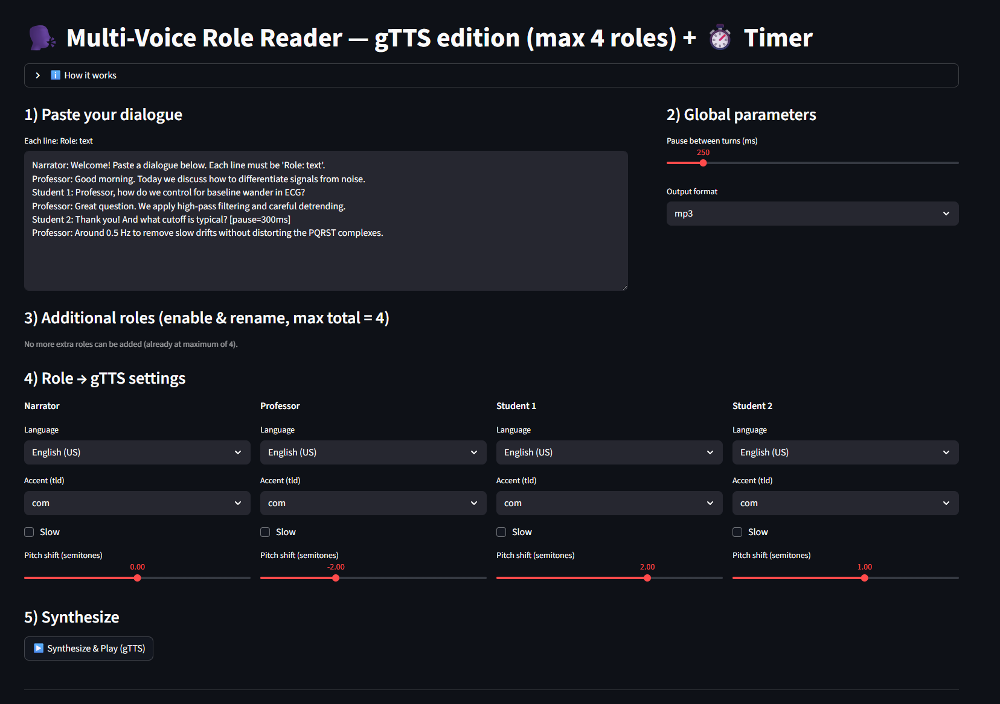
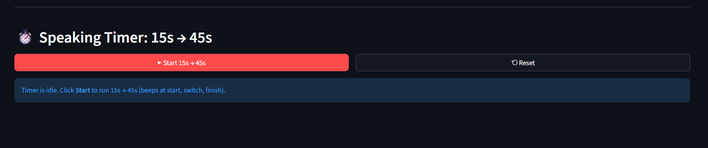

# 🗣️ Multi-Voice Role Reader + Speaking Timer (TOEFL Listening Task 2)

An interactive **Streamlit web app** designed to simulate the **Listening Task 2** of the TOEFL Speaking Section.
It allows you to generate a *multi-voice dialogue* from text, listen to it using synthesized speech (via **Google Text-to-Speech [gTTS]**), and then practice your spoken response with a built-in **15-second → 45-second timer**.

---

## 🎯 Purpose

This app reproduces the structure of **TOEFL Speaking Task 2**, where a short conversation or lecture excerpt is played, and the examinee prepares (15 s) and speaks (45 s) about what they heard.
The tool allows students and instructors to:

* Generate dialogues with **multiple speakers or roles** (e.g., Professor, Student 1, Student 2).
* Control accents, languages, and pitch per role.
* Insert **custom pauses** to simulate realistic conversational timing.
* Automatically start a **speaking timer** with auditory cues.

---

## 🧰 Features

### 🗣️ Multi-Voice Dialogue Generator

* Supports up to **4 roles** (e.g., Professor, Narrator, Student 1, Student 2).
* Each role can have its own **language**, **accent (tld)**, **speech rate**, and **pitch shift**.
* Add inline pauses with tags such as `[pause=300ms]`.
* Adjustable **global pause** between turns.
* Export synthesized dialogue as `.mp3` or `.wav`.



### ⏱️ Speaking Timer

* Two sequential phases:

  * **15 seconds** → Preparation
  * **45 seconds** → Response
* Audible **beeps** indicate start, transition, and finish.
* Reset function stops the timer anytime.


---

## 🚀 Usage

1. **Paste your dialogue**
   Each line must follow the format

   ```
   Role: text
   ```

   Example:

   ```
   Professor: Good morning. Today we’ll discuss adaptive filters.
   Student 1: What is baseline wander in ECG signals?
   Professor: It’s a slow drift of the baseline caused by respiration or movement.
   ```

2. **Adjust settings**

   * Select accents (`tld` = `com`, `co.uk`, `com.mx`, etc.).
   * Choose languages (English, Spanish, Portuguese, French, …).
   * Set pitch (−6 to +6 semitones) and speed (slow/normal).
   * Define global pause and output format.

3. **Generate audio**
   Click **“▶ Synthesize & Play (gTTS)”** to produce and play the conversation.
   Download the audio file to reuse for listening practice.

4. **Practice your response**
   Scroll down to **Speaking Timer** and click **Start 15s → 45s**.

   * First beep → Begin 15 s prep.
   * Second beep → Begin 45 s response.
   * Final beep → End of task.

---

## 🧪 Technologies

| Component                        | Description                              |
| -------------------------------- | ---------------------------------------- |
| **Streamlit**                    | Interactive web interface                |
| **gTTS (Google Text-to-Speech)** | Speech synthesis                         |
| **pydub + ffmpeg**               | Audio composition and silence generation |
| **Python dataclasses / regex**   | Dialogue parsing and processing          |
| **Base64 HTML audio**            | Autoplay beeps and playback              |

---

## 🧩 Installation & Deployment

### 🔹 Local (for testing)

```bash
conda create -n toefl-app python=3.11
conda activate toefl-app
pip install streamlit gTTS pydub
sudo apt install ffmpeg
streamlit run app.py
```

### 🔹 Streamlit Cloud

Include the following files in your GitHub repository:

**`requirements.txt`**

```
streamlit==1.39.0
gTTS==2.5.3
pydub==0.25.1
```

**`packages.txt`**

```
ffmpeg
```

Then go to [https://share.streamlit.io](https://share.streamlit.io), connect your GitHub repo, choose `app.py`, and deploy.

---

## 🧠 Example: TOEFL Task 2 Simulation

```text
Narrator: Now listen to a conversation between a professor and two students.
Professor: Good morning. Today we discuss how to differentiate signals from noise.
Student 1: Professor, how do we control for baseline wander in ECG?
Student 2: Thank you! And what cutoff is typical? [pause=300ms]
Professor: Around 0.5 Hz to remove slow drifts without distorting the waveform.
```

**Step 1:** Paste this dialogue into the text box.
**Step 2:** Select voices and accents.
**Step 3:** Click *Synthesize & Play*.
**Step 4:** Use the timer to record your 45-second response.

---

## ⚠️ Notes & Limitations

* Requires **Internet access** for gTTS (Google API calls).
* Maximum ≈ 4 roles; very long dialogues may timeout.
* Autoplay audio may be blocked on some mobile browsers.
* For neural-quality TTS, substitute a local model (e.g., VITS or Edge-TTS).

---

## 📚 License

MIT License — free for educational and research use.

---

**Author:** *Moises Meza*
**Context:** Academic tool for TOEFL Speaking Task 2 practice in Listening Section.
